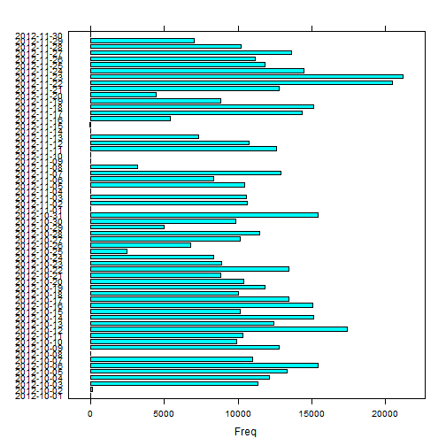
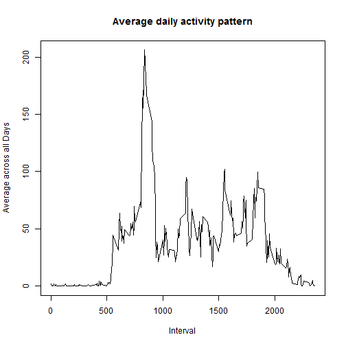
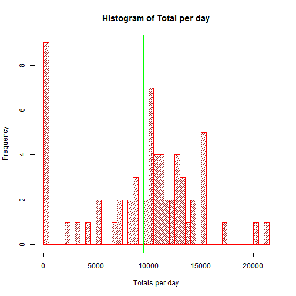
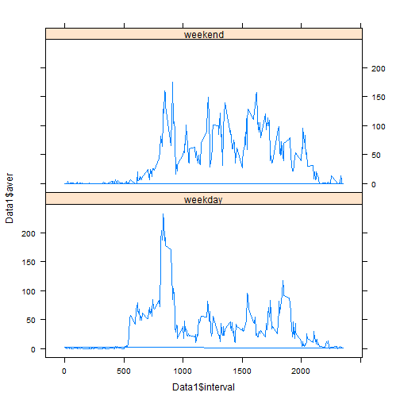

Title
========================================================

This is an R Markdown document. Markdown is a simple formatting syntax for authoring web pages (click the **Help** toolbar button for more details on using R Markdown).

When you click the **Knit HTML** button a web page will be generated that includes both content as well as the output of any embedded R code chunks within the document. You can embed an R code chunk like this:


```r
## Read the data
Sys.setlocale("LC_TIME", "C")
```

```
## [1] "C"
```

```r

Data <- read.csv("activity.csv")

# Understanding the Data


## Part one of assignment Analysis on Total number per days 1. Calculate
## totals per day
totals <- tapply(Data$steps, Data$date, sum, na.rm = TRUE)
### 2. Confirmming I got the totals per day
library("base")
library("lattice")
barchart(totals)
```

 


```r

### 3. Histogram, mean and median
hist(totals, breaks = 50, col = "brown", border = "red", density = 30, main = "Histogram of Total per day", 
    xlab = "Totals per day")
mean(totals)
```

```
## [1] 9354
```

```r
median(totals)
```

```
## [1] 10395
```

```r
abline(v = mean(totals), col = "green")
abline(v = median(totals), col = "red")
```

 


```r


## Average daily ativity pattern
averg <- tapply(Data$steps, Data$interval, mean, na.rm = TRUE)
plot(row.names(averg), averg, type = "l", xlab = "Interval", ylab = "Average across all Days", 
    main = "Average daily activity pattern")
```

 

```r
## Calculation of Interval with maximum number of steps Interval
```


```r
temp <- which.max(averg)
Data$interval[temp]
```

```
## [1] 835
```

```r
averg[temp]
```

```
##   835 
## 206.2
```


```r
Data1 <- Data
## Calculus of number of missing values
isna <- which(is.na(Data1$steps))
length(isna)
```

```
## [1] 2304
```


```r

## Filing missing values with average per interval
Data1$steps[is.na(Data1$steps)] <- averg[which(Data1$interval[is.na(Data1$steps)] == 
    names(averg))]
head(Data1$steps)
```

```
## [1] 1.71698 0.33962 0.13208 0.15094 0.07547 2.09434
```

```r
head(Data$steps)
```

```
## [1] NA NA NA NA NA NA
```

```r
head(Data$interval)
```

```
## [1]  0  5 10 15 20 25
```

```r
head(names(averg))
```

```
## [1] "0"  "5"  "10" "15" "20" "25"
```

```r
averg[1]
```

```
##     0 
## 1.717
```

```r
averg[2]
```

```
##      5 
## 0.3396
```

```r

## New histogram with Data1 without missing values
totals2 <- tapply(Data1$steps, Data1$date, sum, na.rm = TRUE)
hist(totals2, breaks = 50, col = "brown", border = "red", density = 30, main = "Histogram of Total per day", 
    xlab = "Totals per day")
mean(totals2)
```

```
## [1] 9531
```

```r
median(totals2)
```

```
## [1] 10439
```

```r
abline(v = mean(totals2), col = "green")
abline(v = median(totals2), col = "red")
```

 

```r

```


```r


weekd <- weekdays(as.Date(Data1$date))
wdaysa <- factor(ifelse((weekd == "Sunday" | weekd == "Saturday"), "weekend", 
    "weekday"))
Data1$wdays <- wdaysa

## Average week no week ativity pattern

averg2 <- tapply(Data1$steps[(Data1$wdays == "weekday")], Data1$interval[(Data1$wdays == 
    "weekday")], mean, na.rm = TRUE)
averg3 <- tapply(Data1$steps[(Data1$wdays == "weekend")], Data1$interval[(Data1$wdays == 
    "weekend")], mean, na.rm = TRUE)

Data1$aver <- NA

for (i in 1:length(Data1$aver)) {
    if (Data1$wdays[i] == "weekday") {
        Data1$aver[i] <- averg2[which(Data1$interval[i] == names(averg))]
    }
    if (Data1$wdays[i] == "weekend") {
        Data1$aver[i] <- averg3[which(Data1$interval[i] == names(averg))]
    }
}
xyplot(Data1$aver ~ Data1$interval | Data1$wdays, Data1, layout = c(1, 2), type = "l")
```

 

```r

```

